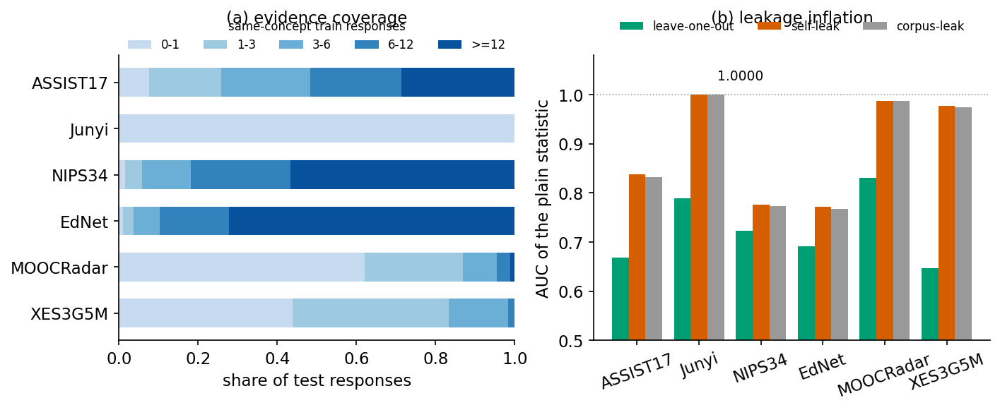
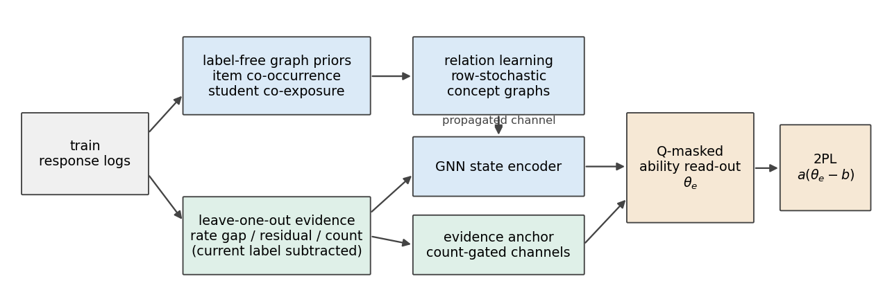
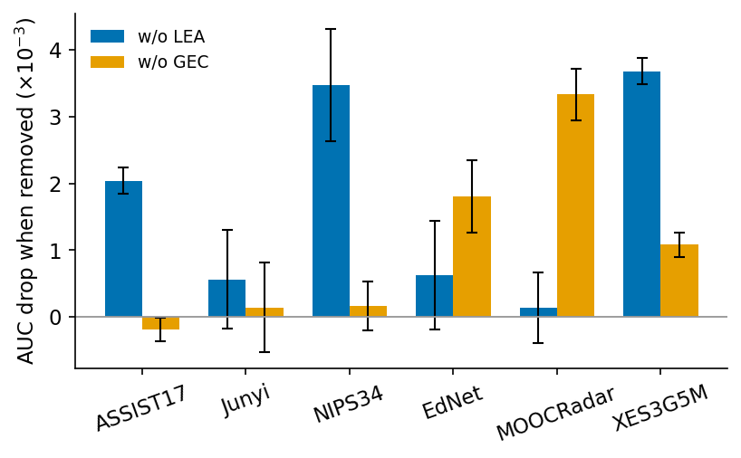
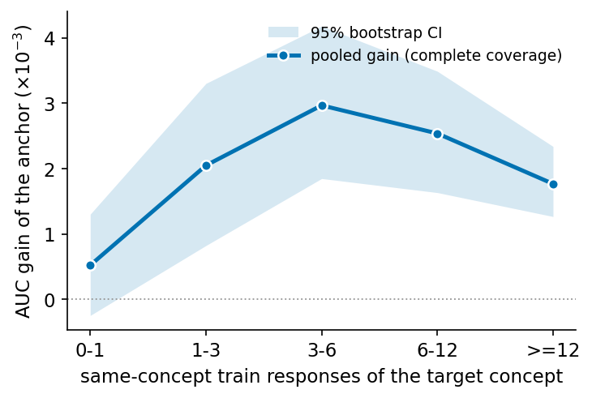
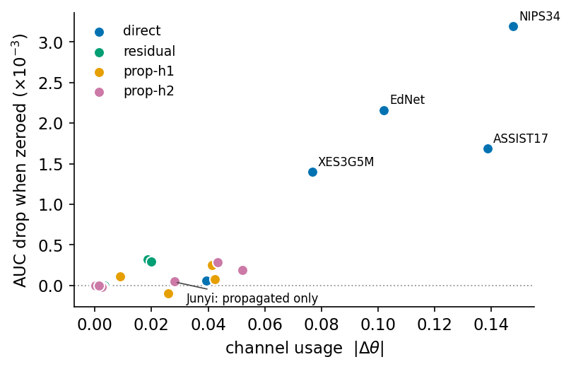

# LEA-CD：面向同概念作答稀缺的防泄漏统计锚定认知诊断框架

> 稿件状态：中文完整初稿 v1.1（2026-07-18，用词打磨版）。模型名 LEA-CD（Leakage-free Evidence Anchoring for Cognitive Diagnosis；英文名中的 evidence 取教育测量含义，中文行文使用"作答统计"）。全部数字来自 sealed test 与 `results/multiseed_auc_summary.csv`、`results/evidence_gain_curve_v3.csv`、`results/anchor_contribution_v2.csv`。

## 摘要

认知诊断根据学生的历史作答记录与 Q 矩阵估计其对知识概念的掌握水平，为习题推荐与自适应练习提供基础信息。现有方法通常以学生嵌入刻画学生状态，当目标概念在该学生的历史中缺少同概念作答时，嵌入缺乏可依据的观测；把同概念正确率等作答统计直接作为输入特征是一种常见的补充，但这类特征的预测力来源此前没有被分析过。本文对此开展实证分析，发现其表面预测力主要来自一个标签泄漏项：当前样本的标签以 $(y-\hat m)/(n+2)$ 的形式进入自身预测，观测次数越少泄漏越强，在单次作答占主导的数据集上一个零参数统计即可取得完美排序；改用逐行扣除当前标签的留一构造后，统计特征回到真实水平且仍保留可用信息。基于这一发现，本文提出 LEA-CD：防泄漏统计锚定模块把留一统计经计数门控以非负权重叠加到概念能力上；概念图校准模块从训练日志构造不使用标签的概念关系图，把相邻概念的统计传播到观测稀缺的目标概念。在六个真实数据集上，LEA-CD 在五个数据集上取得高于最强基线的 AUC，分桶分析显示增益集中在同概念作答少于 6 次的测试子集。

## 1 引言

随着在线教育平台的普及，认知诊断（Cognitive Diagnosis, CD）已成为智能教育系统的基础任务。认知诊断模型（CDMs）通过分析学生的历史作答记录，估计其对各知识概念的掌握水平，并支撑习题推荐、学习路径规划与计算机自适应测试等下游应用（Wang et al. 2020; Wang et al. 2024）。

现有认知诊断方法主要沿三条线发展。IRT 与 DINA 等传统方法使用教育测量假设和人工设计的交互函数描述学生能力与习题属性（Hambleton and Swaminathan 1985; de la Torre 2009）。NCDM 与 KaNCD 使用神经网络建模学生、习题与概念之间的非线性交互（Wang et al. 2020, 2023a）。RCD、SCD、ORCDF、SVGCD 与 NCDLA 进一步利用图神经网络学习教育实体之间的高阶关系，并提高诊断的稳健性（Gao et al. 2021; Wang et al. 2023b; Qian et al. 2024; Xia et al. 2025; Zhang et al. 2026）。

从教育测量的角度看，对目标概念的掌握估计应当与该概念相关的观测作答建立联系。然而真实日志中这一联系经常是稀缺的：如图 1(a) 所示，在六个公开数据集上，大量测试作答的目标概念在该学生的训练历史中只出现过很少几次，部分数据集的绝大多数测试作答都处于这种状态。本文将该场景称为同概念作答稀缺：目标概念缺少足够的同概念历史作答，模型需要依赖间接观测完成诊断。

现有方法难以妥善处理这一场景。图方法通过嵌入平滑缓解稀疏，但嵌入无法区分观测充足与观测稀缺两种情形。把学生的历史正确率等作答统计直接作为输入特征是更直接的补充，这类特征在知识追踪中也被广泛使用；但它的预测力有多少来自学生的真实状态、有多少来自构造方式本身，此前没有被分析过。

为回答这一问题，本文对作答统计特征开展实证分析（第 3 节），得到两个发现。其一，未加保护的统计构造存在标签泄漏：当前样本的标签会进入其自身预测的输入，泄漏强度随观测次数减少而增大，极端情形下一个零参数统计即可在 Junyi 上取得 AUC 1.0000（图 1(b)）——这类特征的表面预测力大部分来自泄漏而非真实信息。其二，以逐行扣除当前样本的留一方式重新构造后，统计特征回到真实水平且仍保留可用信息，而观测稀缺的区间恰好是嵌入最薄弱、最需要补充的区间。由此得到的结论是：作答统计值得使用，但必须以防泄漏的方式进入模型，并配合跨概念结构覆盖观测稀缺的区间。

基于上述发现，本文提出 LEA-CD（Leakage-free Evidence Anchoring for Cognitive Diagnosis）。针对泄漏风险，防泄漏统计锚定模块（Leakage-free Evidence Anchoring，LEA）在训练时从每条统计中扣除当前样本的标签贡献，并通过计数门控与非负权重把留一统计叠加到概念能力上；针对同概念作答稀缺，概念图校准模块（Graph Evidence Calibration，GEC）从训练日志构造不使用标签的概念关系图，把相邻概念的作答统计沿行随机关系传播到目标概念。两个模块共享同一个标量 2PL 读出。

本文的主要贡献概括如下：

- 本文首次分析了作答统计特征在认知诊断中的标签泄漏机制：给出偏差的显式形式 $(y-\hat m)/(n+2)$，说明其随观测次数减少而放大、足以支配评测指标，并在六个数据集上验证了该偏差的实际幅度。
- 本文提出 LEA-CD，通过留一构造使作答统计与自身标签无关，通过概念图在低作答次数区间补足观测，两者以计数门控在同一能力标量上融合。
- 在六个真实数据集、六个随机种子上的实验表明，LEA-CD 在五个数据集上超过最强基线；分桶分析与通道置零分析显示，增益集中于同概念作答较少的子集，各统计通道的使用模式与数据结构一致。

## 2 相关工作

**认知诊断模型。** IRT 与 DINA 等传统方法使用人工设计的交互函数描述学生能力与习题属性（Hambleton and Swaminathan 1985; de la Torre 2009）。NCDM 将单调性假设引入神经交互函数，KaNCD 通过矩阵分解刻画概念间关联（Wang et al. 2020, 2023a）。这些方法以学生嵌入承载学生状态，在目标概念缺少同概念作答时缺乏直接的观测依据。

**图增强认知诊断。** RCD 构造学生—习题—概念多重关系图，SCD 采用自监督图学习缓解长尾问题，ORCDF 通过抗过平滑的图卷积改进表示，SVGCD 与 NCDLA 分别从变分对比与低秩对齐的角度提高图表示的稳健性（Gao et al. 2021; Wang et al. 2023b; Qian et al. 2024; Xia et al. 2025; Zhang et al. 2026）。与这些方法相比，本文不追求更强的图编码器：图的作用被限定为把相邻概念的作答统计传播到目标概念，用于补足稀缺的同概念观测。

**作答统计特征与泄漏风险。** 把历史正确率等统计量作为输入特征在知识追踪中较为常见，认知诊断中也有方法引入类似信号。若统计构造把当前样本计入，训练目标可以直接复制标签，验证与测试指标随之被高估；ISGCN 等工作讨论了图上错误信息的传播，但未处理统计特征把自身标签计入的问题（Shao et al. 2025）。本文给出该偏差的显式形式，并以留一构造消除它。

## 3 同概念作答稀缺与标签泄漏的实证分析

如引言所述，作答统计特征在直觉上是同概念作答稀缺场景的自然补充，但其预测力的来源尚不清楚：现有工作把这类特征当作普通输入使用，没有分析其中有多少来自学生的真实状态、有多少来自构造方式本身。本节在与实验一致的六个数据集与划分上分析这一问题。

**分析协议。** 我们选取不含任何可学习参数的最简统计作为探针：学生 $s$ 在概念 $c$ 上的拉普拉斯平滑正确率 $(S_{s,c}+1)/(n_{s,c}+2)$，其中 $n_{s,c}$、$S_{s,c}$ 分别为训练集中的同概念作答次数与答对次数；对多概念习题取 Q 矩阵内各概念统计的均值，直接以该统计作为预测分数，在测试集上计算 AUC。统计按三种方式构造，三者输入相同、参数为零，差别只在当前样本的标签是否参与自身预测：语料泄漏构造把包括当前样本在内的全部作答计入统计（对应把统计特征在全量数据上预计算的常见做法）；自泄漏构造只把当前样本计入它自己的统计；留一构造从每条统计中逐行扣除当前样本。同时，对每条测试作答记录其目标概念的同概念训练作答次数 $n$，按 $n\in[0,1)$、$[1,3)$、$[3,6)$、$[6,12)$、$[12,\infty)$ 分桶。

**观察一：同概念作答稀缺普遍存在。** 图 1(a) 给出各数据集测试作答的分桶占比。NIPS34 与 EdNet 的多数作答有较充足的同概念历史；Junyi 的全部测试作答落在最低分桶（每名学生对每个概念至多作答一次）；MOOCRadar 与 XES3G5M 分别有 95.4% 与 98.4% 的作答少于 6 次。稀缺不是个别数据集的特例，模型需要同时处理观测充足与观测稀缺两种情形。

**观察二：泄漏支配了统计特征的表面预测力。** 图 1(b) 给出三种构造的测试 AUC。语料泄漏与自泄漏构造在所有数据集上都明显高于留一构造：Junyi 上恰为 1.0000，MOOCRadar 与 XES3G5M 分别被抬高约 0.16 与 0.33；留一构造回到真实水平（Junyi 0.7891、XES3G5M 0.6472），但仍明显高于随机，说明扣除泄漏后统计特征依然保留可用信息。高估幅度与观察一中的低次数占比同向：同概念作答越稀缺的数据集被抬得越高。命题 1 解释这一现象。

**命题 1（泄漏偏差）。** 若样本 $i$（标签 $y_i$）被计入其自身输入的统计，则平滑正确率包含项

$$\Delta_i=\frac{y_i-\hat m_i}{n_{s,c}+2},$$

其中 $\hat m_i$ 为扣除样本 $i$ 后的平滑正确率。$\Delta_i$ 与标签同号，幅度随 $n_{s,c}$ 减小而增大；当 $n_{s,c}=0$ 时统计完全由当前标签决定，对该子集可取得完美排序。由观察一，Junyi 的全部测试作答满足 $n=0$，命题 1 因此预测其泄漏构造的 AUC 恰为 1，与图 1(b) 的测量精确一致。

**命题 2（标签无关性）。** 留一构造把样本 $i$ 的标签、计数与残差贡献从其全部输入统计中扣除，因此样本 $i$ 的输入与 $y_i$ 无关：翻转 $y_i$ 不改变其任何输入特征，训练目标无法通过复制标签下降。我们在全部六个数据集上按位验证了该不变性。

**命题 3（单调性）。** 统计量以非负权重进入能力标量时，模型预测对同概念正确率单调不减，掌握度的解释方向与教育测量约定一致。

上述分析得到本节的结论：作答统计特征的表面预测力大部分来自标签泄漏，经留一构造扣除后仍保留可用信息，且观测稀缺的数据集受泄漏影响最大。这给出 LEA-CD 的两条设计要求：(R1) 统计必须以逐行扣除的留一形式进入模型，并以非负、门控的方式参与预测（命题 2、3）；(R2) 观测稀缺区间的诊断需要把相邻概念的观测经概念结构传播过来（观察一）。第 4 节的 LEA 与 GEC 模块分别落实这两条要求。

## 4 方法

### 4.1 记号与问题定义

设学生、习题与概念集合分别为 $\mathcal S$、$\mathcal E$ 与 $\mathcal C$（$|\mathcal C|=K$）。Q 矩阵 $\mathbf Q\in\{0,1\}^{|\mathcal E|\times K}$ 给出习题与概念的关联。训练作答集合为 $\mathcal R=\{(s_i,e_i,y_i)\}$，$y_i\in\{0,1\}$。给定学生 $s$、习题 $e$ 及其概念集合 $\mathcal C_e=\{c\mid Q_{e,c}=1\}$，模型输出答对概率 $\hat y$。测试作答按目标概念的同概念训练作答次数分桶，仅用于分组分析，不改变训练与评测样本。全部统计量、图先验与 ID 映射只从训练集构造。

整体框架如图 2 所示。训练日志提供两类输入：概念共现结构与作答统计。GEC 由共现结构学习行随机关系图，用于平滑概念状态并为统计传播提供权重；LEA 构造留一作答统计，经计数门控修正概念能力。两个模块在 Q 掩码的能力读出处融合，经单一 2PL 项输出预测。

### 4.2 防泄漏统计锚定模块（LEA）

**留一统计。** 对学生 $s$ 与概念 $c$，记训练集中同概念作答次数与答对次数为 $n_{s,c}$ 与 $S_{s,c}$。预测训练样本 $i$ 时，两者先扣除样本 $i$ 自身的贡献（记 $n^{\setminus i}$、$S^{\setminus i}$），再计算平滑正确率

$$\hat r^{\setminus i}_{s,c}=\frac{S^{\setminus i}_{s,c}+\bar m_c}{n^{\setminus i}_{s,c}+1},$$

其中 $\bar m_c$ 为概念 $c$ 的全体训练正确率。验证与测试样本不在训练统计中，直接读取完整统计。由此得到两个截断后的统计通道：正确率通道 $e^{\mathrm{dir}}_{s,c}\propto\hat r^{\setminus i}_{s,c}-\bar m_c$，以及以习题难度为基准的残差通道 $e^{\mathrm{res}}_{s,c}$（把每次作答的实际结果与难度预期之差按概念累积后取均值）。两个通道都只依赖训练作答与训练难度统计。

**计数门控。** 统计量的可靠性随观测次数变化：单次作答得到的正确率波动很大，多次作答后才趋于稳定。为此每个通道配一个计数门

$$g_{\mathrm{ch}}(n)=\sigma\!\left(a_{\mathrm{ch}}+b_{\mathrm{ch}}\log(1+n)\right),$$

并以逐概念的非负权重把门控后的统计量叠加到概念能力上：

$$\theta_{s,c}=\theta^{\mathrm{state}}_{s,c}+\sum_{\mathrm{ch}}\mathrm{softplus}(W_{c,\mathrm{ch}})\,g_{\mathrm{ch}}(n_{s,c})\,e^{\mathrm{ch}}_{s,c},$$

其中 $\theta^{\mathrm{state}}_{s,c}$ 为图状态读出（4.3 节），通道集合包含正确率通道、残差通道与传播通道（4.3 节）。非负权重保证预测对统计量单调不减；训练期间对修正项施加随机失活，防止模型过度依赖单一统计。

### 4.3 概念图校准模块（GEC）

**不使用标签的图先验。** 从训练日志构造两个概念共现矩阵：习题共现 $M^{\mathrm{item}}_{a,b}=\sum_e Q_{e,a}Q_{e,b}\,\mathbb I[a\neq b]$，以及学生共接触矩阵 $M^{\mathrm{exp}}_{a,b}$（统计同一学生在训练中同时接触概念 $a,b$ 的人数）。两者只反映概念在教学中的组织方式，与作答对错无关。

**行随机关系学习。** 以先验为支撑集，模型对每个关系头 $h$ 学习

$$R_h(c,k)=\operatorname{softmax}_{k\in\mathcal N(c)}\!\left(\frac{s_h(c,k)}{\tau}\right),$$

其中 $\mathcal N(c)$ 为先验中概念 $c$ 的 top-$k$ 邻域，$s_h$ 由先验强度与可学习偏置构成。$R_h(c,k)$ 表示概念 $k$ 对概念 $c$ 的支持权重，仅用于统计聚合的索引方向，不表示先修关系。

**状态平滑与统计传播。** 关系图以两种方式参与预测。其一，概念状态经 $\alpha$ 混合的消息传递平滑：$\mathbf H^{(l+1)}=(1-\alpha)\mathbf H^{(l)}+\alpha\,\bar R\,\mathbf H^{(l)}$，读出得到 $\theta^{\mathrm{state}}$。其二，每个关系头把留一统计从邻域聚合到目标概念，构成 LEA 的传播通道：

$$e^{\mathrm{prop},h}_{s,c}=\sum_{k}R_h(c,k)\,e^{\mathrm{dir}}_{s,k}.$$

当目标概念自身没有同概念作答时，正确率通道的门控值接近零，传播通道仍可依据相邻概念的作答给出修正，从而落实设计要求 R2。

### 4.4 预测与优化

习题 $e$ 的能力读出为 Q 掩码均值 $\theta_e=\frac{1}{|\mathcal C_e|}\sum_{c\in\mathcal C_e}\theta_{s,c}$，预测为单一 2PL 项

$$\hat y=\sigma\!\left(a_e(\theta_e-b_e)\right),$$

其中难度 $b_e$ 为标量、区分度 $a_e$ 经 softplus 保持为正。训练目标为标准二元交叉熵。

## 5 实验

### 5.1 实验设置

**数据集。** 实验使用六个真实数据集：ASSIST17、Junyi、NIPS34、EdNet、MOOCRadar 与 XES3G5M，划分与统计见表 1；全部 ID 映射、Q 矩阵、图先验与作答统计只从训练集构造，验证与测试样本过滤到训练可见的学生与习题。

**表 1　数据集统计**

| 数据集 | #学生 | #习题 | #概念 | #作答 | 稀疏度 |
|---|---:|---:|---:|---:|---:|
| ASSIST17 | 1,702 | 3,162 | 102 | 390,281 | 92.75% |
| Junyi | 10,000 | 835 | 835 | 353,835 | 95.76% |
| NIPS34 | 4,918 | 948 | 85 | 1,382,727 | 70.34% |
| EdNet | 1,776 | 11,988 | 189 | 824,329 | 96.13% |
| MOOCRadar | 2,000 | 915 | 696 | 385,323 | 78.94% |
| XES3G5M | 2,000 | 1,624 | 241 | 207,204 | 93.62% |

**对比方法。** 包括传统模型 IRT 与 DINA，神经模型 NCDM 与 KaNCD，归纳模型 ICDM，以及图结构模型 RCD、SCD、ORCDF 与 SVGCD。所有方法使用相同划分，基线数字取自相同划分下的公开实现结果。

**实现设置。** 嵌入维度、学习率与 dropout 等超参数按验证集 AUC 选择（维度 8–64，学习率 1e-3 或 2e-4，dropout 0.10–0.25）；检查点仅按验证集 AUC 选取，测试集只在最终评测使用一次。LEA-CD 的结果为六个随机种子的均值 ± 标准差。

### 5.2 总体性能

**表 2　总体性能对比（AUC / ACC；加粗为每列最优）**

| 模型 | ASSIST17 | Junyi | NIPS34 | EdNet | MOOCRadar | XES3G5M |
|---|---|---|---|---|---|---|
| IRT | 0.7635 / 0.7011 | 0.8194 / 0.7625 | 0.7622 / 0.6961 | 0.7335 / 0.7102 | 0.8874 / 0.9016 | 0.7797 / 0.8307 |
| DINA | 0.6601 / 0.5643 | 0.6459 / 0.4982 | 0.7122 / 0.5779 | 0.6320 / 0.5290 | 0.7225 / 0.5190 | 0.6387 / 0.5738 |
| NCDM | 0.7391 / 0.6926 | 0.6123 / 0.3643 | 0.7745 / 0.7105 | 0.6684 / 0.6589 | 0.8119 / 0.8764 | 0.7212 / 0.8193 |
| KaNCD | 0.7792 / 0.7148 | 0.7227 / 0.6743 | 0.7851 / 0.7165 | 0.7270 / 0.7011 | 0.9206 / 0.9077 | 0.7406 / 0.8156 |
| ICDM | 0.7741 / 0.7076 | 0.7951 / 0.7474 | 0.7767 / 0.7077 | 0.7353 / 0.7089 | 0.9156 / 0.9078 | 0.7591 / 0.8255 |
| RCD | 0.7845 / 0.7179 | **0.8320** / **0.7722** | 0.7758 / 0.7079 | 0.7439 / 0.7127 | 0.9205 / 0.9085 | 0.7944 / 0.8353 |
| ORCDF | 0.7875 / 0.7179 | 0.8246 / 0.7668 | 0.7893 / **0.7218** | 0.7480 / 0.7127 | 0.9332 / 0.9148 | 0.7924 / 0.8363 |
| SCD | 0.7854 / 0.7156 | 0.8118 / 0.7530 | 0.7890 / 0.7204 | 0.7464 / 0.7138 | 0.9311 / 0.9143 | 0.7920 / 0.8359 |
| SVGCD | 0.7847 / 0.7179 | 0.8250 / 0.7655 | 0.7826 / 0.7118 | 0.7470 / 0.7149 | 0.9301 / 0.9149 | 0.7920 / 0.8354 |
| **LEA-CD** | **0.7890±.0001** / **0.7188±.0002** | 0.8304±.0005 / 0.7712±.0006 | **0.7899±.0004** / 0.7210±.0005 | **0.7484±.0004** / **0.7165±.0005** | **0.9341±.0004** / **0.9156±.0003** | **0.8007±.0001** / **0.8381±.0003** |

表 2 给出三点观察。第一，LEA-CD 在五个数据集上取得最高 AUC，XES3G5M 上的提升最大（较 RCD 提高 0.0063）；六个种子的标准差均不超过 0.0005，结果对随机种子稳健。第二，EdNet 上的优势较小（较 ORCDF 提高 0.0004），与其低次数分桶占比最低一致：当多数作答都有充足的同概念历史时，嵌入已能承载大部分信息。第三，Junyi 上 LEA-CD 次于 RCD（差 0.0016）。RCD 使用专家标注的先修关系图，而 Junyi 每名学生对每个概念至多作答一次，从日志能构造的结构信息有限；LEA-CD 不使用任何专家标注，在其余五个数据集上均超过 RCD。ACC 上 LEA-CD 在四个数据集最优，NIPS34 与 Junyi 分别与最优差 0.0008 与 0.0010。

### 5.3 模块消融

分别移除两个模块：w/o LEA 去掉全部作答统计与门控修正（模型退化为纯图—嵌入路径），w/o GEC 去掉状态消息传递与传播通道（统计只保留同概念直接进入）。六个种子的结果见表 3 与图 3。

**表 3　模块消融（AUC，六种子均值 ± 标准差）**

| 数据集 | LEA-CD | w/o LEA | w/o GEC |
|---|---|---|---|
| ASSIST17 | 0.7890±.0001 | 0.7869±.0001 | 0.7891±.0001 |
| Junyi | 0.8304±.0005 | 0.8298±.0005 | 0.8303±.0004 |
| NIPS34 | 0.7899±.0004 | 0.7865±.0008 | 0.7898±.0000 |
| EdNet | 0.7484±.0004 | 0.7478±.0007 | 0.7466±.0003 |
| MOOCRadar | 0.9341±.0004 | 0.9340±.0004 | 0.9308±.0000 |
| XES3G5M | 0.8007±.0001 | 0.7970±.0001 | 0.7996±.0001 |

两个模块的贡献呈现互补的分布。LEA 的贡献集中在 ASSIST17、NIPS34 与 XES3G5M（降幅 0.0020–0.0037），这些数据集有足量的同概念作答可供统计；GEC 的贡献集中在 MOOCRadar 与 EdNet（0.0033 与 0.0018），其概念数多或作答分散，跨概念传播的作用更大。ASSIST17 上移除 GEC 后 AUC 基本不变（−0.0002），与其概念图规模最小一致。Junyi 上两个模块的单独贡献都较小，与 5.2 节对其数据结构的分析吻合。

### 5.4 分桶增益分析

为检验增益是否来自目标场景，将测试作答按同概念训练作答次数分桶，比较 LEA-CD 与 w/o LEA 在每个分桶内的 AUC 差，并做学生层面的配对 bootstrap（1000 次）。合并曲线只使用五个分桶全覆盖的四个数据集（ASSIST17、NIPS34、EdNet、MOOCRadar；各分桶样本量 28,656 / 21,800 / 28,630 / 47,097 / 104,543），避免分桶之间数据集构成变化影响曲线形状。

图 4 呈现先升后降的形态：0–1 次分桶的增益接近零（+0.0005，区间含零），1–3、3–6、6–12 与 ≥12 次分桶的增益依次为 +0.0020、+0.0030、+0.0025、+0.0018，四个分桶的置信区间均不含零，峰值出现在 3–6 次分桶。该形态与模块的工作方式一致：目标概念完全没有同概念作答时，计数门的取值接近零，统计修正量也接近零；出现少量作答后，嵌入尚未从稀疏观测中学到该学生—概念组合，统计量的边际价值最大；观测继续增多，嵌入自身已能刻画该组合，增益幅度减小但保持为正。逐数据集看，NIPS34 的 1–3 次分桶增益达 +0.0051（区间 [+0.0016, +0.0087]），XES3G5M 的 1–3 次分桶为 +0.0052（[+0.0030, +0.0074]），低次数子集的收益在这两个数据集上最为明显。

### 5.5 统计通道的行为分析

为区分"模型使用了哪个通道"与"该通道对预测的贡献"，对每个数据集统计各通道的实际使用量（对 $\theta$ 的平均修正幅度），并把该通道权重置零后重新评测验证 AUC。

图 5 给出两点观察。第一，正确率通道是主要贡献来源：NIPS34、EdNet、ASSIST17 与 XES3G5M 上置零该通道分别损失 0.0032、0.0022、0.0017 与 0.0014 的 AUC，使用量与贡献同向。第二，通道的使用模式跟随数据结构：Junyi 上模型把正确率与残差通道的权重学习为零，只保留传播通道——该数据集每名学生对每个概念至多作答一次，留一扣除后同概念统计恒为空，跨概念传播成为唯一可用的输入。残差与传播通道的单独贡献较小但基本非负，与通道权重非负的构造一致。

## 6 结论

本文研究了认知诊断中的同概念作答稀缺场景，给出作答统计特征的标签泄漏偏差 $(y-\hat m)/(n+2)$，并据此提出 LEA-CD：留一构造使统计与自身标签无关，计数门控与非负权重把统计叠加到概念能力上，概念图把相邻概念的观测传播到目标概念，全部信号经单一 2PL 项输出。六个数据集上的实验表明，LEA-CD 在五个数据集上超过最强基线，增益集中于同概念作答较少的子集，通道行为与各数据集的作答结构一致。后续工作将探索把留一统计锚定作为通用组件嵌入其他诊断骨干，以及在概念层级结构上的统计传播。

## 参考文献

Chang, H.-S.; Hsu, H.-J.; and Chen, K.-T. 2015. Modeling Exercise Relationships in E-Learning: A Unified Approach. In *Proceedings of the 8th International Conference on Educational Data Mining*, 532–535.

Choi, Y.; Lee, Y.; Shin, D.; et al. 2020. EdNet: A Large-Scale Hierarchical Dataset in Education. In *Proceedings of the 21st International Conference on Artificial Intelligence in Education*, 69–73.

de la Torre, J. 2009. DINA Model and Parameter Estimation: A Didactic. *Journal of Educational and Behavioral Statistics*, 34(1): 115–130.

Feng, M.; Heffernan, N.; and Koedinger, K. 2009. Addressing the Assessment Challenge with an Online System that Tutors as It Assesses. *User Modeling and User-Adapted Interaction*, 19: 243–266.

Gao, W.; Liu, Q.; Huang, Z.; et al. 2021. RCD: Relation Map Driven Cognitive Diagnosis for Intelligent Education Systems. In *Proceedings of the 44th International ACM SIGIR Conference*, 501–510.

Hambleton, R. K.; and Swaminathan, H. 1985. *Item Response Theory: Principles and Applications*. Boston: Kluwer-Nijhoff.

Liu, S.; Shen, J.; Qian, H.; and Zhou, A. 2024. Inductive Cognitive Diagnosis for Fast Student Learning in Web-Based Intelligent Education Systems. In *Proceedings of the ACM Web Conference 2024*, 4260–4271.

Liu, Z.; Liu, Q.; Guo, T.; et al. 2023. XES3G5M: A Knowledge Tracing Benchmark Dataset with Auxiliary Information. In *Advances in Neural Information Processing Systems*, 36.

Qian, H.; Liu, S.; Li, M.; et al. 2024. ORCDF: An Oversmoothing-Resistant Cognitive Diagnosis Framework for Student Learning in Online Education Systems. In *Proceedings of the 30th ACM SIGKDD Conference*, 2455–2466.

Shao, P.; Yang, Y.; Gao, Y.; et al. 2025. Exploring Heterogeneity and Uncertainty for Graph-based Cognitive Diagnosis Models in Intelligent Education. In *Proceedings of the 31st ACM SIGKDD Conference*, 1233–1243.

Wang, F.; Liu, Q.; Chen, E.; et al. 2020. Neural Cognitive Diagnosis for Intelligent Education Systems. In *Proceedings of the AAAI Conference on Artificial Intelligence*, 34(4): 6153–6161.

Wang, F.; Liu, Q.; Chen, E.; et al. 2023a. NeuralCD: A General Framework for Cognitive Diagnosis. *IEEE Transactions on Knowledge and Data Engineering*, 35(8): 8312–8327.

Wang, F.; Gao, W.; Liu, Q.; et al. 2024. A Survey of Models for Cognitive Diagnosis: New Developments and Future Directions. *arXiv preprint arXiv:2407.05458*.

Wang, S.; Zeng, Z.; Yang, X.; and Zhang, X. 2023b. Self-Supervised Graph Learning for Long-Tailed Cognitive Diagnosis. In *Proceedings of the AAAI Conference on Artificial Intelligence*, 37(1): 110–118.

Wang, Z.; Lamb, A.; Saveliev, E.; et al. 2021. Results and Insights from Diagnostic Questions: The NeurIPS 2020 Education Challenge. In *Proceedings of the NeurIPS 2020 Competition and Demonstration Track*, 191–205.

Xia, C.; Liu, F.; Wang, Z.; et al. 2025. Semantic-Tailored Variational-Contrastive Graph Learning for Cognitive Diagnosis. In *Companion Proceedings of the ACM Web Conference 2025*, 1946–1952.

Yu, J.; Lu, M.; Zhong, Q.; et al. 2023. MoocRadar: A Fine-Grained and Multi-Aspect Knowledge Repository for Improving Cognitive Student Modeling in MOOCs. In *Proceedings of the 46th International ACM SIGIR Conference*, 2924–2934.

Zhang, G.; Zhang, Y.; Yuan, G.; et al. 2026. Noise-Aware Graph-Based Cognitive Diagnostic Framework Through Low-Rank Alignment. In *Proceedings of the AAAI Conference on Artificial Intelligence*, 40(19): 16280–16288.
