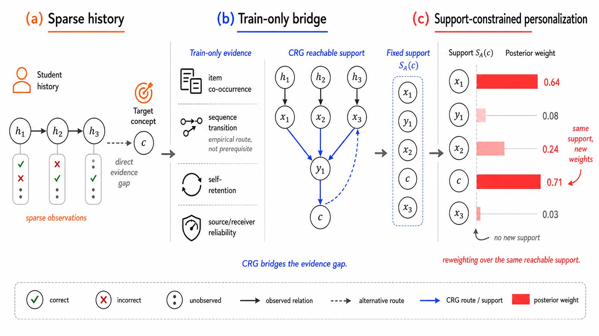
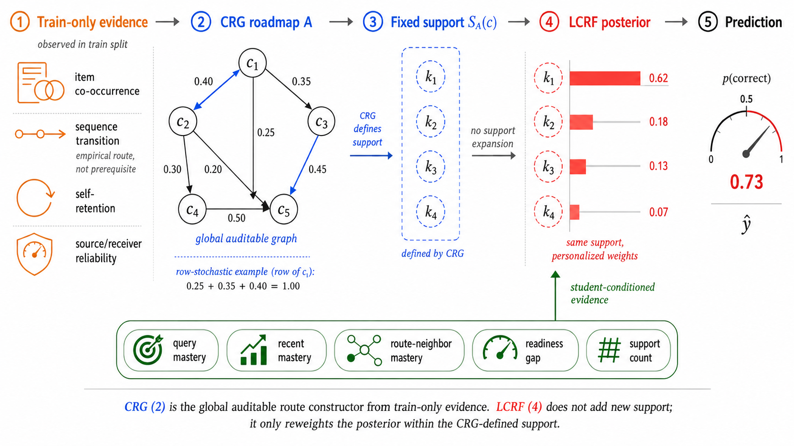
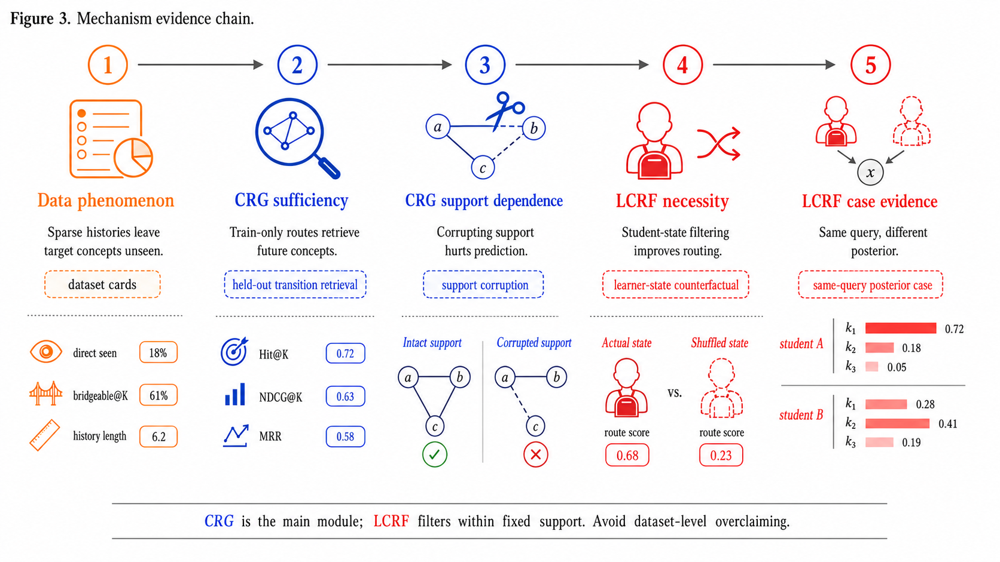
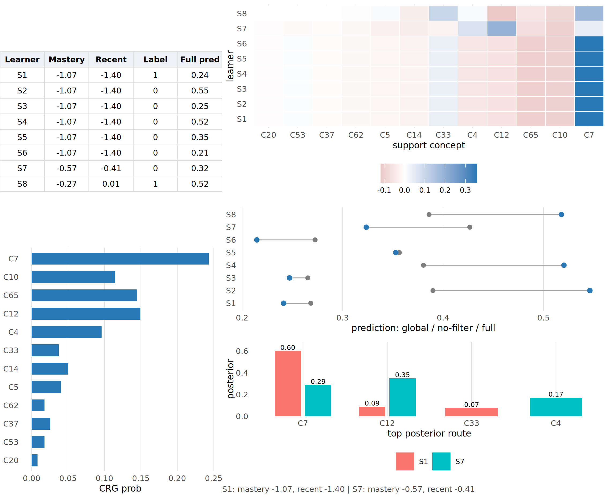

# 面向概念证据缺口的可审计概念可达性认知诊断

## 摘要

认知诊断旨在根据学生历史作答记录估计其对知识概念的掌握状态。现有神经认知诊断与图认知诊断模型通常依赖学生-题目响应日志和题目-概念矩阵进行预测，但在真实学习平台中，学生历史并不总是直接覆盖当前测试题涉及的目标概念。当目标概念缺少直接历史证据时，模型需要回答一个关键问题：**当前诊断能否获得可审计的概念支持？** 本文将这一现象定义为**概念证据缺口**。为缓解该问题，本文提出一种证据约束的概念可达性认知诊断框架，包括概念可达图（Concept Reachability Graph, CRG）和学习者条件化可达性过滤器（Learner-Conditioned Reachability Filter, LCRF）。CRG 从训练阶段可观测的题内概念共现、序列转移和自保持证据中估计全局概念路线图；LCRF 在 CRG 给出的固定 support 内，根据学生掌握度、近期表现和历史计数重排后验路线权重。三组核心数据集 `assist_09`、`junyi` 和 `assist_17` 上的实验表明，CRG 能有效检索 held-out concept transitions，并在 support perturbation 中表现出可观的路线依赖性；LCRF 的学生状态反事实和 same-query case 进一步显示，同一 CRG support 可以被不同学生过滤成不同 posterior route。上述结果表明，CRG-LCRF 能够为稀疏概念证据场景提供可审计的路线支持与支持约束的个性化诊断。

**关键词**：认知诊断；概念证据缺口；概念可达图；训练集证据；学习者条件化过滤；机制可解释性

---

## 1. 引言

认知诊断（Cognitive Diagnosis, CD）是智能教育系统中的基础任务，其目标是根据学生历史作答记录推断学生对知识概念的掌握状态。诊断结果可以服务于个性化练习推荐、补救学习、学习路径规划和自适应测试。近年来，神经认知诊断和图认知诊断模型通过更复杂的学生-题目交互函数、概念图传播或学生-题目-概念异构图建模提升了预测性能。然而，这些方法通常默认学生历史记录能够为当前目标概念提供足够的直接证据。

在真实学习平台中，这一默认条件并不总是成立。学生不会完整练习所有知识点，当前测试题涉及的目标概念可能从未在该学生历史中出现，或者只在极少量历史记录中出现。此时，模型如果仅依赖学生已经作答过的概念维度，就会面临一个直接的诊断依据缺口：当前目标概念虽然需要被预测，但学生历史中没有足够直接证据。本文将这一现象称为**概念证据缺口**。

概念证据缺口并不等同于简单的数据稀疏。对于认知诊断而言，关键不只是学生历史长度是否短，而是当前目标概念是否能从学生历史概念中获得可审计连接。即使一道题只对应一个知识点，训练集日志中仍可能存在从历史概念到目标概念的经验性学习路线，例如不同概念在学生训练序列中的转移关系。相反，如果只依赖题内多概念共现，那么在 `junyi` 这类 100% 单概念题数据集中，概念图将退化为近似空图。因此，本文不把“题内概念共现”作为唯一关系来源，而是把它作为训练集经验路线的一种可用证据。

为解决这一问题，本文提出 CRG/LCRF 两阶段机制。CRG 首先估计全局概念可达 support，用于刻画当前目标概念能否从学生历史概念通过训练集路线被连接；LCRF 随后在该固定 support 上建模学习者条件化 posterior，用于判断同一条可达路线对当前学生的可信程度。CRG 的 support 是可审计的、由训练阶段证据估计的；LCRF 的 posterior 在该 support 内完成学习者条件化重排。

{#fig:concept-gap width=100%}

如图 \ref{fig:concept-gap} 所示，概念证据缺口描述的是目标概念与学生历史概念之间缺少直接可审计连接的场景。左侧的学生历史包含已观测过的概念及有限正确、错误、未观测记录，目标概念 \(c\) 需要被预测，但并未出现在该学生的历史概念集合中。中间的 CRG 利用训练集中的经验路线把历史概念连接到目标概念，其中 sequence transition 表示训练日志中的经验学习路线，而非严格先修关系。右侧的 LCRF 进一步在 CRG 给出的固定 support 内进行个性化后验重排，使 posterior mass 随学生状态变化而变化。

本文贡献如下：

1. 提出“概念证据缺口”视角，将直接覆盖不足场景下的认知诊断转化为训练集概念路线的检索与过滤问题。
2. 设计 CRG，只使用训练集题内共现、序列转移和自保持证据构造可审计全局概念路线图。
3. 设计 LCRF，根据学生 mastery、recent mastery 和历史计数对同一 CRG support 进行后验过滤。
4. 设计一组机制实验链：retrieval 验证 CRG 找路能力，support corruption 验证模型是否依赖 CRG support，state counterfactual 分析 LCRF 对学习者状态的使用，same-query case 展示同一 support 的个性化过滤。

---

## 2. 相关工作

### 2.1 认知诊断模型

传统认知诊断模型通常建立在心理测量理论之上，例如 IRT、MIRT 和 DINA。它们通过预设的交互函数描述学生能力、题目难度和作答结果之间的关系，具有较强解释性，但表达能力有限。神经认知诊断模型进一步使用神经网络建模复杂的学生-题目交互，使模型能够从大规模作答数据中学习非线性诊断函数。典型方法通常以学生嵌入、题目嵌入和概念嵌入作为输入，通过预测学生在题目上的作答结果来优化模型。

尽管这些方法提升了预测性能，但它们通常没有显式区分“目标概念是否有直接历史证据”和“目标概念是否能通过训练集概念路线被连接”。当学生历史中缺少某个目标概念时，模型可能只能依赖 ID embedding 或全局统计模式进行预测，难以给出可审计的概念层解释。

### 2.2 图认知诊断与关系感知建模

图认知诊断模型通过学生-题目图、题目-概念图或异构图传播建模高阶关系。相关工作表明，图结构可以提升认知诊断模型对学生和题目的表示能力，并有助于显式建模概念、题目和学生之间的依赖关系。与此同时，图结构也要求模型明确边的来源、方向和可靠性。若概念关系仅由题内共现或全局可训练参数隐式生成，当目标概念缺少学生历史中的直接证据时，模型仍难以说明当前预测依赖哪些可审计概念路线。本文从概念 support 来源出发，将概念关系建模为训练阶段可观测证据约束下的可达路线，并进一步在固定 support 内进行学习者条件化过滤。

### 2.3 认知诊断中的稀疏概念证据

现有研究已从冷启动学生/题目、非随机缺失响应、噪声交互和不可靠图边等角度研究认知诊断中的数据不足问题。这些工作主要关注实体缺失、观测偏差或交互噪声。与之不同，本文关注目标概念层面的直接证据缺失：学生可能拥有一定长度的历史作答记录，但这些记录并不直接覆盖当前题目所需的概念。因此，模型需要判断目标概念能否由历史概念通过可审计概念路线获得支持，并进一步判断该支持是否适合当前学生。CRG 和 LCRF 分别对应这两个层次：前者构造全局可达 support，后者在固定 support 内建模学习者条件化 posterior。

---

## 3. 问题定义：概念证据缺口

设学生、题目和概念集合分别为 \(\mathcal{U}\)、\(\mathcal{E}\) 和 \(\mathcal{C}\)。题目-概念矩阵 \(Q\) 描述每道题涉及的概念，学生作答日志 \(\mathcal{R}\) 由学生、题目和二值作答结果组成。给定学生 \(u\) 在时间 \(t\) 的 query exercise，记 \(H_{u,t}\) 为该学生此前作答历史中出现过的概念集合。

本文使用两个诊断量刻画 query 的概念证据条件。直接覆盖 \(D_{u,t}(c)\) 表示目标概念 \(c\) 是否已经出现在 \(H_{u,t}\) 中；CRG reachability 表示目标概念是否能在 CRG 给出的固定 support \(S_A(c)\) 中获得证据支持。这两个量用于数据现象分析和机制解释，而不是限制预测任务本身；模型仍在完整作答样本上训练与评估。概念可达图由训练阶段可观测的概念关系估计，并在验证与测试阶段保持固定。

---

## 4. 数据现象

表 1 展示三个核心数据集的概念可达性画像。它们并不是同一种数据分布，而是分别支撑论文主线的不同侧面。

**表 1：三核心数据集的概念可达性画像**

| 数据集    | 单概念比例 | 多概念比例 | item edge density | sequence edge density | direct-unseen rate | bridge-only rate | 历史长度中位数 |
| --------- | ---------: | ---------: | ----------------: | --------------------: | -----------------: | ---------------: | -------------: |
| assist_09 |      82.8% |      17.2% |              0.9% |                 64.3% |               3.1% |             3.1% |             41 |
| junyi     |     100.0% |       0.0% |              0.0% |                 25.2% |             100.0% |           99.97% |             25 |
| assist_17 |      78.3% |      21.7% |              6.2% |                 76.3% |               2.8% |             2.8% |            148 |

从表 1 可以看出，三组数据集均呈现不同形式的概念证据缺口。`junyi` 没有题内概念共现，但 direct-unseen rate 与 bridge-only rate 均很高，适合检验 sequence route 的可达支持。`assist_09` 和 `assist_17` 则更接近常规 benchmark 场景，少量题内共现与较强序列路线共同存在。上述差异说明，概念可达性不能仅由题内多概念共现刻画，还需要训练日志中的经验学习路线提供补充支持。

---

## 5. 方法

### 5.1 框架总览

本文框架包括两个递进组件：CRG 和 LCRF。CRG 负责全局路线构造，用于形成可审计、训练集约束的概念路线图；LCRF 负责在固定 CRG support 上进行学习者条件化后验过滤。整体流程为：

\[
\text{train-only evidence}\rightarrow A_{\mathrm{CRG}}\rightarrow S_A(c)\rightarrow P_{u,t}(k|c)\rightarrow \hat{r}_{u,e}.
\]

其中 \(S_A(c)\) 是概念 \(c\) 的固定 CRG support，\(P_{u,t}(k|c)\) 是 LCRF 产生的学生条件化后验路线分布。

{#fig:model-architecture width=100%}

图 \ref{fig:model-architecture} 展示了 CRG/LCRF 的整体机制路径。首先，CRG 只从训练阶段证据中构造概念路线图，证据包括题内共现、序列转移、自保持以及 source/receiver reliability；这些证据共同形成一个全局、可审计、行随机化的概念关系图 \(A_{\mathrm{CRG}}\)。随后，CRG 为当前 query concept 给出固定 support \(S_A(c)\)，该 support 决定了后续可被使用的候选概念范围。LCRF 根据 query mastery、recent mastery、route-neighbor mastery、readiness gap 和 support count 等学习者状态信号，对同一 support 内的 posterior weight 进行个性化重排。该设计使 CRG 负责构造可审计路线，LCRF 负责在同一路线集合内进行学习者条件化过滤。

### 5.2 概念可达图 CRG

CRG 为 query concept \(c\) 和候选 support concept \(k\) 估计全局路线分数。路线证据包括题内共现、经验序列转移、自保持，以及 source/receiver reliability。设归一化后的证据向量为：

\[
\phi_{c,k}=
\left[
\tilde M^{\mathrm{item}}_{c,k},
\tilde M^{\mathrm{seq}}_{c,k},
\mathbb{I}(c=k),
\mathrm{rel}^{src}_{c},
\mathrm{rel}^{rec}_{k}
\right],
\quad
s_{c,k}=\mathbf{w}^{\top}\phi_{c,k}.
\]

其中 \(\tilde M^{\mathrm{item}}\) 表示题内共现证据，\(\tilde M^{\mathrm{seq}}\) 表示训练日志中的经验学习路线；本文不将 sequence transition 解释为严格先修关系或因果依赖。CRG 先收集 evidence-supported candidates，再在固定候选集合 \(S_A(c)\) 上进行行归一化：

\[
A_{\mathrm{CRG}}(c,k)=
\operatorname{softmax}_{k\in S_A(c)}
\left(\frac{s_{c,k}}{\tau}\right).
\]

因此，\(A_{\mathrm{CRG}}\) 是由训练阶段证据估计得到的全局概念路线图，\(S_A(c)\) 是后续 LCRF 可使用的固定 support。

### 5.3 学习者条件化可达性过滤器 LCRF

CRG 给出全局 support，但同一条路线对不同学生不一定同等可信。LCRF 在 \(S_A(c)\) 内计算学生条件化后验：

\[
P_{u,t}(k|c)=
\operatorname{softmax}_{k\in S_A(c)}
\left[
\log A_{\mathrm{CRG}}(c,k)+
f_{\theta}(u,t,c,k)
\right].
\]

其中 \(f_{\theta}(u,t,c,k)\) 由 query mastery、recent mastery、route-neighbor mastery、readiness gap 和 support count 等学生状态信号计算。由于 softmax 被限制在 \(S_A(c)\) 内，LCRF 不新增 support concept，只改变 CRG 候选路线上的 posterior mass。预测时，posterior 可用于聚合 route-neighbor mastery：

\[
\tilde{m}_{u,t}(c)=
(1-\gamma)m_{u,t}(c)+
\gamma\sum_{k\in S_A(c)}P_{u,t}(k|c)m_{u,t}(k).
\]

最终，support-aware mastery representation 被送入诊断预测头得到作答概率 \(\hat r_{u,e}\)。模型使用训练作答上的二分类交叉熵进行优化。

## 6. 实验设计

本文实验围绕四个目标展开。首先，通过模块消融评估 CRG-LCRF 的预测性能以及 CRG、LCRF 对完整模型的贡献。其次，检验 CRG 是否能够基于训练阶段获得的概念路线检索 held-out concept transitions。第三，在推理阶段扰动 reachable support，评估预测是否依赖 CRG 给出的支持集合。最后，通过学生状态反事实和 same-query case 分析 LCRF 是否在固定 support 内产生学习者条件化的 posterior 变化。

{#fig:evidence-chain width=100%}

如图 \ref{fig:evidence-chain} 所示，本文实验按照机制证据链组织。第一步通过 dataset cards 描述核心数据集中的 sparse history 与 target concept unseen 现象；第二步通过 held-out transition retrieval 验证 CRG 是否能仅依赖训练阶段路线检索未来概念；第三步通过 support corruption 检查预测是否依赖 CRG 给出的 reachable support；第四步通过 learner-state counterfactual 检验真实学生状态是否可以被群体平均或错配状态替代；第五步通过 same-query posterior case 展示同一 query、同一 CRG support 下，不同学生获得不同 posterior route。该实验链对应 CRG 的路线构造能力、CRG support 的预测贡献，以及 LCRF 在固定 support 内的个性化过滤作用。

### 6.1 模块消融

表 2 展示三核心数据集上的主消融结果。`full` 表示 CRG+LCRF 完整模型；`no_CRG` 移除全局路线图；`no_LCRF` 保留 CRG 但移除学习者条件化过滤。

**表 2：三核心数据集主消融结果**

| 数据集    | 模型变体 |    AUC |    ACC |   RMSE | 相对 Full 的 AUC 下降 |
| --------- | -------- | -----: | -----: | -----: | --------------------: |
| assist_09 | full     | 0.7783 | 0.7407 | 0.4178 |                0.0000 |
| assist_09 | no_CRG   | 0.7671 | 0.7320 | 0.4222 |                0.0112 |
| assist_09 | no_LCRF  | 0.7634 | 0.7309 | 0.4247 |                0.0149 |
| junyi     | full     | 0.8291 | 0.7688 | 0.4008 |                0.0000 |
| junyi     | no_CRG   | 0.8278 | 0.7691 | 0.4011 |                0.0013 |
| junyi     | no_LCRF  | 0.8286 | 0.7701 | 0.3994 |                0.0005 |
| assist_17 | full     | 0.7847 | 0.7151 | 0.4321 |                0.0000 |
| assist_17 | no_CRG   | 0.7647 | 0.6973 | 0.4413 |                0.0200 |
| assist_17 | no_LCRF  | 0.7829 | 0.7132 | 0.4359 |                0.0018 |

表 2 展示了 CRG-LCRF 及其模块消融的预测性能。完整模型在 `assist_09` 和 `assist_17` 上均取得最高 AUC，相比 `no_CRG` 分别提升 1.12% 和 2.00%。移除 LCRF 在 `assist_09` 上带来更明显下降，而在 `junyi` 与 `assist_17` 的直接模块删除设置下影响较小。该结果表明，CRG 提供主要的 reachable-support 信号；LCRF 的作用则需要结合第 6.4 节的学习者状态反事实进一步分析。

### 6.2 CRG 路线检索：held-out transition retrieval

为了验证 CRG 是否具备 train-only 找路能力，本文使用训练集构造 CRG，并在 held-out concept transition 上评估检索。对比方法包括 self-only、random/uniform、degree-random 和 best CRG。

**表 3：CRG held-out transition retrieval 结果**

| 数据集    | Self Hit@10 | Random/Uniform Hit@10 | Degree-random Hit@10 | Best CRG Hit@10 | Best CRG NDCG@10 | Best CRG MRR |
| --------- | ----------: | --------------------: | -------------------: | --------------: | ---------------: | -----------: |
| assist_09 |      0.1124 |                0.1321 |               0.1358 |          0.3673 |           0.1964 |       0.1699 |
| junyi     |      0.0020 |                0.0219 |               0.0171 |          0.1648 |           0.0782 |       0.0717 |
| assist_17 |      0.1320 |                0.1544 |               0.1618 |          0.4113 |           0.2293 |       0.1987 |

结果显示，Best CRG 在三个数据集上均显著强于 self-only 和 random baselines。`junyi` 尤其重要，因为其 item edge density 为 0，说明 CRG 的检索能力并不依赖题内多概念共现；sequence route 可以成为主要路线来源。

### 6.3 CRG 支持依赖：support corruption

Retrieval 评估 CRG 的路线恢复能力。为了进一步分析预测过程对 CRG support 的依赖，本文进行 support corruption：在不重训的情况下，替换或破坏 CRG support，并观察预测性能变化。对照包括 evidence support corruption、degree-matched random support、sequence-shuffled support 和 self-only fallback。

**表 4：100% support corruption 下的预测损伤（all subgroup）**

| 数据集    | 破坏类型            |  AUC drop | BCE increase |
| --------- | ------------------- | --------: | -----------: |
| assist_09 | evidence corruption |    0.0148 |       0.0086 |
| assist_09 | degree-random       | 约 0.0146 |    约 0.0071 |
| assist_09 | sequence-shuffled   | 约 0.0043 |   约 -0.0007 |
| junyi     | evidence corruption |    0.0019 |       0.0095 |
| assist_17 | evidence corruption |    0.0111 |       0.0223 |
| assist_17 | degree-random       | 约 0.0032 |    约 0.0178 |
| assist_17 | sequence-shuffled   | 约 0.0001 |    约 0.0001 |

表 4 表明，CRG support perturbation 会改变模型预测表现。`assist_17` 中 evidence corruption 明显强于 degree-random，尤其 AUC drop gap 更突出，说明模型对 evidence-supported routes 具有较强依赖。`assist_09` 中 evidence corruption 与 degree-random 接近，体现出模型对候选 support substrate 的依赖。`junyi` 的 AUC 变化较小，但 BCE increase 仍显示 support 扰动会影响概率校准。

### 6.4 LCRF 学生状态反事实

本文通过三种反事实变体分析 LCRF 对学习者状态的使用方式：`no_filter` 表示移除 LCRF；`mean_state` 用群体平均学生状态替代真实状态；`shuffle_state` 打乱学生状态。

**表 5：LCRF counterfactual 结果**

| 数据集    | 变体          |    AUC |   RMSE | 相对 Full 的 AUC 下降 |
| --------- | ------------- | -----: | -----: | --------------------: |
| assist_09 | no_filter     | 0.7634 | 0.4247 |                0.0149 |
| assist_09 | mean_state    | 0.6065 | 0.4827 |                0.1718 |
| assist_09 | shuffle_state | 0.5751 | 0.5070 |                0.2032 |
| junyi     | no_filter     | 0.8286 | 0.3994 |                0.0005 |
| junyi     | mean_state    | 0.8259 | 0.4017 |                0.0033 |
| junyi     | shuffle_state | 0.8188 | 0.4049 |                0.0103 |
| assist_17 | no_filter     | 0.7829 | 0.4359 |                0.0018 |
| assist_17 | mean_state    | 0.6441 | 0.4865 |                0.1406 |
| assist_17 | shuffle_state | 0.5966 | 0.5196 |                0.1881 |

表 5 区分了模块移除和状态替换两类干预。`no_filter` 反映移除 LCRF 后的整体预测变化；`mean_state` 和 `shuffle_state` 进一步检验真实学习者状态是否可以由群体平均状态或错配状态替代。`assist_09` 和 `assist_17` 在 mean/shuffle 干预下出现明显下降，说明 LCRF 的 posterior route 依赖学习者条件化状态，而不是固定全局补丁。

### 6.5 LCRF same-query posterior case

为了验证 LCRF 是否真的在同一 CRG support 内做个性化过滤，本文固定同一个 query concept 和相同 CRG support，比较不同学生得到的 posterior route 分布。

`assist_17` 的主 case 为 `assist_17_Q14_S25`。该 case 中所有学生共享相同 support，support size 为 25；候选统计显示 mean pairwise L1 最高可达到约 0.801，JS 约 0.129。two-student case 中，S1 与 S7 的 posterior route 差异明显。

**表 6：assist_17 two-student same-query posterior case**

| 学生 | true label | query mastery | recent mastery | pred_global | pred_full | top support | posterior prob | global prob | posterior-global |
| ---- | ---------: | ------------: | -------------: | ----------: | --------: | ----------- | -------------: | ----------: | ---------------: |
| S1   |          1 |        -1.065 |         -1.405 |       0.268 |     0.241 | C7          |          0.600 |       0.243 |            0.356 |
| S1   |          1 |        -1.065 |         -1.405 |       0.268 |     0.241 | C12         |          0.088 |       0.149 |           -0.062 |
| S1   |          1 |        -1.065 |         -1.405 |       0.268 |     0.241 | C33         |          0.075 |       0.037 |            0.038 |
| S7   |          0 |        -0.568 |         -0.409 |       0.427 |     0.324 | C12         |          0.348 |       0.149 |            0.199 |
| S7   |          0 |        -0.568 |         -0.409 |       0.427 |     0.324 | C7          |          0.287 |       0.243 |            0.044 |
| S7   |          0 |        -0.568 |         -0.409 |       0.427 |     0.324 | C4          |          0.169 |       0.096 |            0.073 |

该 case 展示了 LCRF 的个性化过滤机制：在同一 query、同一 CRG support 下，不同学生会得到不同 posterior route。

{#fig:lcrf-same-query width=100%}

图 \ref{fig:lcrf-same-query} 进一步可视化了 LCRF 如何把同一全局 support 过滤成学生局部 posterior route。两个学生共享相同 CRG support，但 posterior mass 集中到不同 support concepts，预测概率也随之发生不同幅度的变化。

### 6.6 学习者状态来源分析

表 7 展示 LCRF learner-state source analysis。已有结果显示，`mean_state_keep_id` 和 `shuffle_state_keep_id` 会显著伤害 `assist_09` 和 `assist_17`，说明 query mastery、recent mastery 和 route-neighbor state 等学习者状态是 LCRF posterior 变化的重要来源。

**表 7：LCRF learner-state source analysis**

| 数据集    | 变体                  |    AUC | AUC drop |
| --------- | --------------------- | -----: | -------: |
| assist_09 | full                  | 0.7783 |   0.0000 |
| assist_09 | shuffle_state_keep_id | 0.5751 |   0.2032 |
| assist_09 | mean_state_keep_id    | 0.6065 |   0.1718 |
| assist_09 | global_only           | 0.7634 |   0.0149 |
| assist_17 | full                  | 0.7847 |   0.0000 |
| assist_17 | shuffle_state_keep_id | 0.5966 |   0.1881 |
| assist_17 | mean_state_keep_id    | 0.6441 |   0.1406 |
| assist_17 | global_only           | 0.7829 |   0.0018 |
| junyi     | full                  | 0.8291 |   0.0000 |
| junyi     | shuffle_state_keep_id | 0.8188 |   0.0103 |
| junyi     | mean_state_keep_id    | 0.8259 |   0.0033 |

这些结果与第 6.4 节的状态反事实相互印证：当真实学习者状态被平均化或错配替换时，LCRF 的后验路线分布和预测表现都会发生明显变化。更细粒度的学生状态来源分解可作为后续扩展方向。

---

## 7. 讨论

本文将概念诊断中的证据来源拆解为两个层次。第一层是全局可审计路线图：在学生历史缺少目标概念直接证据时，模型需要识别哪些历史概念可以通过训练阶段路线支持当前概念。第二层是局部个性化过滤：同一条路线对不同学生不一定同样可信，需要由学生状态决定 posterior route mass。

实验结果揭示了两种互补机制。在题内共现较稀疏的数据中，序列路线为概念可达性提供主要桥接信号；在 support-dependence 更明显的数据中，扰动 CRG support 会直接影响预测，说明模型利用了检索到的路线支持，而不是仅依赖全局先验。LCRF 则进一步在相同 support 内引入学习者条件化 posterior shift，使不同学生在同一 query 下可以强调不同支撑概念。

这组发现与模块定位一致：CRG 提供面向概念证据缺口的全局路线支持，LCRF 在固定 support 内进行学习者条件化过滤。二者共同使模型能够从“是否存在可审计路线”和“该路线是否适合当前学生”两个层次组织诊断证据。

---

## 8. 结论

本文提出面向概念证据缺口的可审计概念可达性认知诊断框架。CRG 从训练集题内共现、序列转移和自保持证据中构造全局概念路线图，用于连接学生历史概念和当前目标概念；LCRF 在 CRG 固定 support 内，根据学生状态重排 posterior route，实现局部个性化过滤。

三核心数据集上的实验表明，CRG 能有效检索 held-out concept transitions，support perturbation 会影响预测表现；LCRF 在 `assist_09` 和 `assist_17` 上通过 mean/shuffle counterfactual 展示真实学生状态的重要性，并通过 same-query case 展示同一 support 被不同学生过滤成不同 posterior。该框架为认知诊断中的可审计概念路线建模和个性化路线过滤提供了一种有效方案。未来工作将进一步扩展 CRG 的高阶概念路线建模，并研究更细粒度的学习者状态来源审计。

---

## 参考文献占位

> 注：正式投稿时需要统一 BibTeX。以下只列本草稿中应引用的文献类型。

1. Neural Cognitive Diagnosis / NCDM 原始论文。
2. RCD、SCD、KaNCD 等图式或神经认知诊断代表方法。
3. KCD：冷启动场景和 LLM prior alignment。
4. DBCD：MNAR / counterfactual debiasing。
5. NCDLA：噪声鲁棒认知诊断与谱结构分析。
6. ISG-CD：图边异质性与不确定性，support corruption/control。
7. ESR-CD：student-concept sparsity barrier 相关问题设定参考。
8. DFCD / LRCD：open / zero-shot 认知诊断场景。
