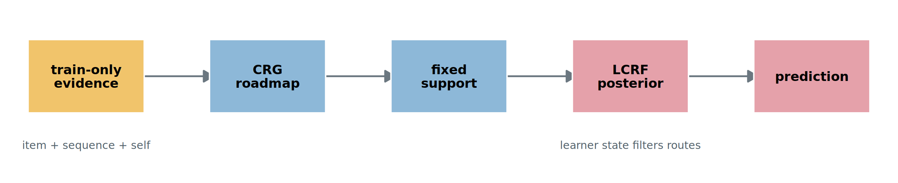
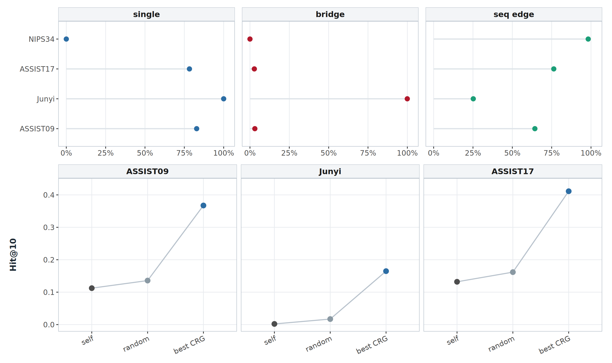
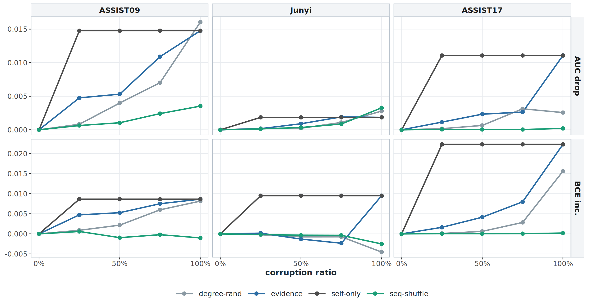
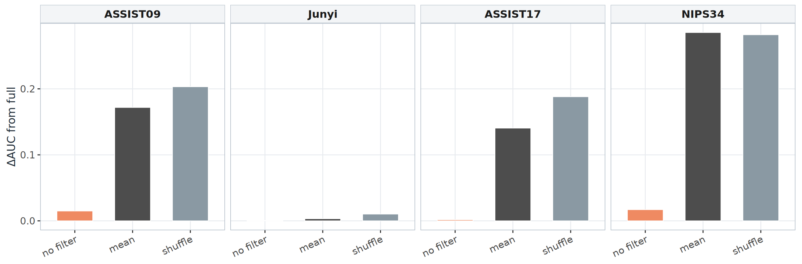
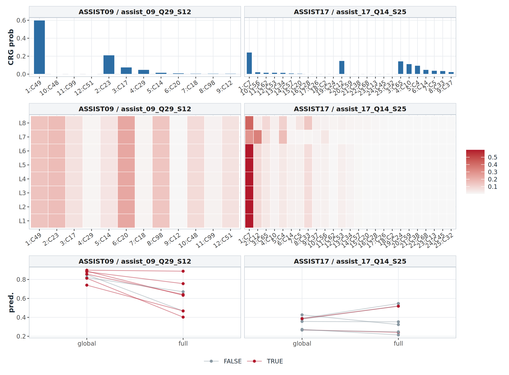

# CRG/LCRF 论文大纲稿

本文当前主线不是证明一个黑盒网络更强，而是从数据现象出发，解释认知诊断中一个更具体的问题：学生在测试中遇到的概念，很多时候不能被历史作答直接覆盖，但可以通过训练集中的概念路径被“到达”。因此模型需要先有一张全局路线图，再根据学生个人状态过滤这张路线图。

> 图片引用说明：本大纲引用同目录 `figures/` 下的 5 张 PNG。交给 GPT Pro 时，请同时上传本 md 和 `figures/` 中的 5 张图；如果只复制 md 文本，任何本地图片路径都不会自动可见。

## 题目占位

**Concept Reachability under Sparse Response Evidence for Cognitive Diagnosis**

中文暂定：**稀疏作答证据下的概念可达性认知诊断**

## 核心问题

现实学习平台中，学生不会完整练习所有知识点，测试题的目标概念也不一定在该学生历史中直接出现。此时诊断模型如果只依赖学生已作答概念，容易缺少连接当前概念的依据。

本文把这个问题定义为 **concept reachability under sparse response evidence**：

- 学生历史中可能没有当前 query concept 的直接证据；
- 但历史概念和当前概念可能通过训练集中的 item co-occurrence 或 sequence transition 连接；
- 这种连接不是严格 prerequisite，而是 train-only empirical learning route；
- 全局路线只说明“有路”，还需要根据学生个人掌握状态判断“这条路对当前学生是否可信”。

## 方法命名

| 组件 | 名称 | 中文解释 | 解决的问题 |
|---|---|---|---|
| CRG | Concept Reachability Graph | 概念可达图 / 全局学习路线图 | 从 train-only item evidence、sequence transition 和 self retention 构建全局概念路线，判断当前概念能否从历史概念到达。 |
| LCRF | Learner-Conditioned Reachability Filter | 学习者条件化可达性过滤器 / 个性化局部路线过滤 | 在 CRG 给出的固定 support 上，根据学生 mastery、recent mastery 和历史邻居证据重排 posterior，不新增边。 |

整体逻辑：

1. CRG 先回答：当前概念是否能从学生历史概念被全局路线连接。
2. LCRF 再回答：这些可达路线中，哪些对当前学生更可信。
3. 预测头使用 CRG/LCRF 产生的概念状态校准，而不是让二者成为弱旁路。



## 数据集定位

主数据集建议使用 `assist_09`、`junyi`、`assist_17`。`nips34` 更适合作为多概念密集场景或附录补充，不建议作为稀疏可达性主证据。

| 数据集 | 数据现象 | 论文定位 |
|---|---|---|
| assist_09 | 单概念题约 82.8%，sequence support 较强，direct unseen 约 3.1%，bridge-only 约 3.1%。 | 主数据集。CRG/LCRF 主消融和机制图都可以讲。 |
| junyi | 单概念题 100%，item co-occurrence 为 0，test query concept 对学生直接未见率 100%，但几乎都可通过 sequence support 桥接。 | 最强的 CRG 数据现象数据集。LCRF 只谨慎补充。 |
| assist_17 | 单概念题约 78.3%，学生历史较长，sequence support 密集。 | CRG 必要性最干净，LCRF same-query posterior 也很强。 |
| nips34 | 多概念题 100%，direct unseen 约 0，不是稀疏可达性的典型场景。 | 附录或对照，不进入核心三数据集叙事。 |

本轮扩展筛查额外检查了 `assist_12`、`assist_15` 和 `assist_12_clean15_item50`：

| 数据集 | 数据画像 | 初筛结果 | 论文定位 |
|---|---|---|---|
| assist_12 | 单概念 100%，item edge 为 0，bridge-only 约 34.0%，CRG retrieval Hit@10 = 0.876。 | full AUC 0.7020，no_CRG 0.7010，no_LCRF 0.6942。CRG 预测必要性弱，LCRF 有小幅信号。 | 只作为 CRG sufficiency 补充，不晋升主数据集。 |
| assist_15 | 单概念 100%，item edge 为 0，bridge-only 约 51.8%，CRG retrieval Hit@10 = 0.533。 | full AUC 0.6566，best val AUC 0.6595，预测初筛失败；已停止 no_CRG/no_LCRF。 | 作为负例/数据卡记录，不进入主文 claim。 |
| assist_12_clean15_item50 | 单概念 100%，item edge 为 0，bridge-only 约 39.5%，CRG retrieval Hit@10 = 0.491。 | 因 assist_12/assist_15 未通过预测初筛，本轮未启动训练。 | 暂不进入主文，可作为后续 appendix 候选。 |

因此当前主线仍保持 `assist_09 / junyi / assist_17`。`assist_12` 和 `assist_15` 可以证明“可达性现象存在”，但不能证明“当前模型在这些新数据集上也形成 prediction-level CRG/LCRF 机制收益”。



## 论文结构草稿

### 1. Introduction

开头不要泛泛说“CDM 缺少可解释性”，而是从现实学习平台的数据稀疏性切入：

- 学生历史覆盖有限，测试概念常常没有 direct response evidence；
- 单概念题或稀疏多概念共现会让 `Q^T Q` 这类 item-only graph 退化；
- 学生学习路径中仍然存在 empirical concept transition，可以作为全局路线；
- 但同一条路线对不同学生不一定同等可信，因此需要个性化过滤。

贡献点：

1. 提出 concept reachability 视角，把稀疏作答证据下的诊断问题转化为“历史概念到当前概念是否可达”。
2. 设计 CRG，从 train-only item co-occurrence、sequence transition 和 self retention 构建可解释全局路线图。
3. 设计 LCRF，在不新增边的前提下，用学生状态对 CRG support 做 posterior filtering。
4. 通过主消融、retrieval、support corruption、counterfactual 和 same-query case 验证 CRG/LCRF 的操作性充分性与必要性。

### 2. Data Phenomenon and Problem Definition

先给数据现象表，再给问题定义。

要写清楚：

- `direct_seen`: 当前 query concept 是否在学生训练历史中直接出现。
- `bridgeable@K`: 当前 query concept 是否能通过 CRG top-K support 从历史概念桥接。
- `item_edges`: item co-occurrence 是否足够。
- `seq_density`: train-only sequence transition 是否能提供路线。

预期结论：

- Junyi 证明“没有 item co-occurrence 也存在可达路径”；
- assist_09 证明“单概念为主但不是完全单概念，适合同时看 CRG 和 LCRF”；
- assist_17 证明“sequence route 在长历史数据上能支撑 CRG 必要性”；
- nips34 只作为密集多概念对照。

### 3. Method

#### 3.1 Concept Reachability Graph

CRG 的边只来自 train-only observable evidence：

- item co-occurrence：同一题内概念共同出现；
- sequence transition：同一学生训练历史中概念接续出现；
- self retention：概念自身状态保持。

建议公式写成 score-level fusion：

```text
s_h(c,k) = beta_item^h z_item(c,k)
         + beta_seq^h z_seq(c,k)
         + beta_self^h 1[c=k]
         + b_recv^h(k)

A_h(c,k) = softmax_{k in S_c}(s_h(c,k) / tau_h)
```

强调：

- 所有 evidence 只来自 train split；
- sequence transition 不声称是 prerequisite，只称为 empirical learning route；
- CRG support 是 LCRF 的固定工作空间。

#### 3.2 Learner-Conditioned Reachability Filter

LCRF 不生成新图，只在 CRG support 上过滤：

```text
log P_{u,t}(k|c) = log A(c,k) + alpha_{u,t,c} Delta_{u,t,c,k}
```

其中 `Delta` 由学生在 query concept 和 support concept 上的 mastery、recent mastery、history count 等可解释状态构成。

要强调：

- 不读 student-id shortcut；
- 不使用任意 MLP 生成图；
- 不扩展 support；
- same query 下，CRG support 相同，但不同学生得到不同 posterior。

### 4. Main Experiments

主表建议只放核心三数据集：

| 数据集 | 作用 |
|---|---|
| assist_09 | CRG/LCRF 都可讲，指标和消融相对完整。 |
| junyi | CRG 现象最强，LCRF 谨慎写。 |
| assist_17 | CRG 必要性最干净，LCRF case 很强。 |

主消融：

- Full: CRG + LCRF；
- no_CRG: 移除全局路线图；
- no_LCRF: 保留 CRG，但移除学习者条件化过滤；
- 可选：base / no_CRG_no_LCRF。

写法要稳：

- 不写“所有数据集上两个模块同等强”；
- 写“CRG 在 sparse reachability 场景中是主贡献，LCRF 在存在状态差异和多候选 support 时提供个体化过滤”。

### 5. Mechanism Experiments

#### 5.1 CRG Sufficiency: Held-out Concept Reachability Retrieval

Claim：仅用 train-only CRG，就能检索 held-out 学生轨迹中的后续概念，强于 random/self。

图：Figure 2 Panel B。

关键结果：

- assist_09: best CRG Hit@10 约 0.367，random 约 0.136，self 约 0.112；
- junyi: best CRG Hit@10 约 0.165，random 约 0.017，self 约 0.002；
- assist_17: best CRG Hit@10 约 0.411，random 约 0.162，self 约 0.132。
- assist_12 / assist_15 / assist_12_clean15_item50: retrieval 也通过，说明这些数据确实有 train-only route 可检索性；但 prediction-level 初筛未通过，所以只能作为 sufficiency 补充。

这证明 CRG 能作为“找路”的充分证据。

#### 5.2 CRG Necessity: Support Corruption Controls

Claim：破坏 CRG support 会伤害预测，说明模型确实依赖可达路线，而不是任意图。

图：Figure 3。



写法：

- assist_17 是最强证据：100% evidence support corruption AUC drop 约 0.0111，BCE increase 约 0.0223，明显强于 degree-matched random；
- assist_09 可写 support-dependence：evidence drop 约 0.0148，但 degree-random drop 约 0.0160，不能写成 evidence edge 独占有效；
- Junyi 较弱：AUC drop 约 0.0019，只报告为弱结果。

#### 5.3 LCRF Necessity: Actual / Shuffle / Mean Counterfactual

Claim：LCRF 的收益来自真实学生状态，不能由打乱或群体平均状态替代。

图：Figure 4。



写法：

- actual LCRF 是干净基线；
- shuffle learner state 明显降低 AUC，说明不是固定补丁；
- mean learner state 也低，说明群体平均不能替代个体状态；
- Junyi 因为主要是 bridge-only，可作为谨慎补充，不作为 LCRF 主战场。

#### 5.4 LCRF Sufficiency: Same Query, Different Learners

Claim：同一个 query、同一个 CRG support，会被不同学习者过滤成不同 posterior，并与预测变化对应。

图：Figure 5。



关键结果：

- assist_09 same-query posterior 过阈值，mean pairwise L1 可用；
- assist_17 更强，mean pairwise L1 约 0.80，JS 约 0.13；
- nips34 same-query posterior 不过阈值，不作为主例。

写法：

- Panel A 展示固定 CRG support；
- Panel B 展示不同学生 posterior heatmap；
- Panel C 展示 full/no_LCRF 或 global/full prediction shift；
- 结论是“同一全局路线图在 LCRF 中被个体状态过滤”，而不是“LCRF 重新发现新图”。

### 6. Discussion and Limits

必须主动写边界：

- CRG 的 evidence edge 在 assist_09 上不是独占强于 degree-random，因此 Figure 3 对 assist_09 只能写 support-dependence；
- Junyi 适合证明 CRG，不适合强行证明 LCRF；
- nips34 不适合稀疏可达性主叙事，只能做多概念对照或附录；
- 本文的 sequence transition 是 empirical route，不是因果 prerequisite。

## 当前图表使用建议

| 图 | 文件 | 主要 claim | 推荐正文位置 |
|---|---|---|---|
| Figure 1 | `fig1_mechanism_crg_lcrf.png` | CRG/LCRF 结构关系 | Method overview |
| Figure 2 | `fig2_data_and_crg_retrieval.png` | 数据现象 + CRG 充分性 | Problem + mechanism experiment |
| Figure 3 | `fig3_crg_support_necessity_controls.png` | CRG 必要性 | Mechanism experiment |
| Figure 4 | `fig4_lcrf_counterfactual_delta_auc.png` | LCRF 必要性 | Mechanism experiment |
| Figure 5 | `fig5_lcrf_same_query_posterior.png` | LCRF 充分性与可解释 case | Mechanism experiment |

## Claim 决策表

| claim | main dataset | supporting dataset | main evidence | success/failure result | paper wording | figure/table location |
|---|---|---|---|---|---|---|
| 数据中存在 concept reachability 问题 | junyi | assist_09, assist_17, assist_12, assist_15 | 数据画像：direct unseen、bridge-only、item edge、seq density | Junyi bridge-only 约 100%；assist_12/15 bridge-only 高但预测初筛弱 | “真实平台中当前概念常无法被学生历史直接覆盖，但可由 train-only empirical route 桥接。” | Figure 2 / data card |
| CRG 具备关系证据充分性 | assist_09, junyi, assist_17 | assist_12, assist_15 | Held-out transition retrieval | 核心三数据集 Hit@10 均明显高于 random/self；assist_12/15 retrieval 更强 | “CRG 能找路，但 retrieval 不等价于预测必要性。” | Figure 2 |
| CRG 具备预测必要性 | assist_17 | assist_09 | Support corruption control | assist_17 evidence corruption 最干净；assist_09 只能写 support-dependence；Junyi 弱 | “模型在部分高路线依赖场景中依赖 CRG support，不能写成所有数据集上 evidence edge 独占有效。” | Figure 3 |
| LCRF 的真实学生状态不可替代 | assist_09, assist_17 | Junyi weak | actual/shuffle/mean counterfactual | 09/17 可写；Junyi 谨慎补充 | “LCRF 的主要证据来自真实 learner state 与 shuffle/mean 的反事实差异。” | Figure 4 |
| LCRF 能把同一 CRG support 过滤成学生局部路线 | assist_17 | assist_09 | same-query posterior + learner heatmap | assist_17/09 过阈值；NIPS34 不作为主例 | “同一全局路线图会被不同学生状态过滤成不同 posterior。” | Figure 5 |
| 新候选数据集是否能进入主线 | none | assist_12, assist_15 | retrieval + one-seed full/no_CRG/no_LCRF screen | assist_12 retrieval 强但 no_CRG 弱；assist_15 full 失败 | “作为数据现象和负例记录，不纳入主结论。” | review packet / appendix |

## 需要 GPT Pro 重点审查的问题

1. “concept reachability under sparse response evidence” 是否足够像一个现实科学问题，而不是方法包装。
2. 三个主数据集 `assist_09 / junyi / assist_17` 是否足够支撑主线，是否应该把 `nips34` 放入附录。
3. CRG 的充分性、必要性证据是否足够；尤其 Figure 3 中 assist_09 的 degree-random 接近问题是否需要进一步弱化表述。
4. LCRF 的 same-query posterior 是否足够证明“个性化过滤”，是否还需要补一个更直接的 case caption 或局部路径图。
5. 当前大纲是否存在过度声称，例如把 sequence transition 写成 prerequisite、把 weak Junyi LCRF 写成强结论。

## Core3 Final Evidence Update


This section is generated from `results/crg_lcrf_core3_final_20260520/` and is restricted to
`assist_09`, `junyi`, and `assist_17`.

### Claim Boundary

- CRG is the main contribution: a train-only concept reachability roadmap built from item co-occurrence, empirical sequence transition, and self retention.
- LCRF is the secondary contribution: a learner-conditioned filter over the fixed CRG support.
- Sequence transition must be described as an empirical learning route, not prerequisite knowledge.
- Do not claim CRG proves evidence-specific superiority on every dataset. Assist_17 is the strongest necessity case, assist_09 supports support-dependence, Junyi is weak at prediction-level corruption but strong as data/retrieval evidence.
- Do not claim Junyi proves LCRF strongly.
- Do not claim LCRF creates new graph edges.
- Do not claim student-ID shortcut is ruled out until the unavailable ID-source audit variants are implemented.

### Core3 Main Table

| dataset | full AUC | no_CRG drop | no_LCRF drop | wording |
|---|---:|---:|---:|---|
| assist_09 | 0.7783 | 0.0112 | 0.0149 | balanced benchmark; both modules usable |
| junyi | 0.8291 | 0.0013 | 0.0005 | CRG reachability/data phenomenon, LCRF weak |
| assist_17 | 0.7847 | 0.0200 | 0.0018 | main CRG necessity evidence; LCRF state counterfactual strong |

### Figure Plan

| figure | claim | main dataset | status |
|---|---|---|---|
| Fig.2 | CRG sufficiency: train-only roadmap retrieves held-out concept routes | assist_09, junyi, assist_17 | use in main |
| Fig.3 | CRG necessity/support dependence under support corruption | assist_17 primary; assist_09 cautious; junyi weak | use with boundary wording |
| Fig.S | CRG subgroup support dependence | assist_17/assist_09 | appendix |
| Fig.4 | LCRF counterfactual: true learner state cannot be replaced by shuffle/mean | assist_09, assist_17 | use in main |
| Fig.5 | LCRF sufficiency: same CRG support becomes different posterior maps | assist_17 primary; assist_09 secondary | use in main |
| Fig.S | LCRF timeline/source audit | assist_09, assist_17 | appendix; source audit limited |

### Decision Table

| claim | main evidence | paper wording |
|---|---|---|
| CRG can find routes | Hit@10 retrieval lift over self/random/degree-random | CRG provides a sufficient train-only roadmap signal. |
| CRG is needed by the trained model | support corruption, especially assist_17 evidence gap/BCE increase | The model relies on CRG support in datasets where evidence support is predictive; this is not universal. |
| LCRF module contributes | no_LCRF drop in main table plus no_filter counterfactual | LCRF improves support-level personalization on balanced/long-history datasets. |
| real learner state matters | shuffle/mean state drops strongly on assist_09 and assist_17 | LCRF should be described as learner-state conditioned, with ID-source audit as a limitation. |
| same support, different learners | same-query posterior heatmap and two-student path | LCRF filters a fixed CRG roadmap into learner-specific local routes. |
